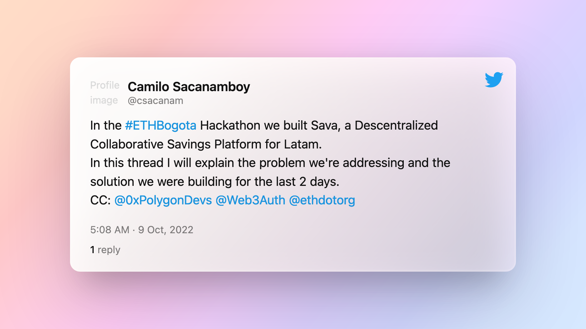
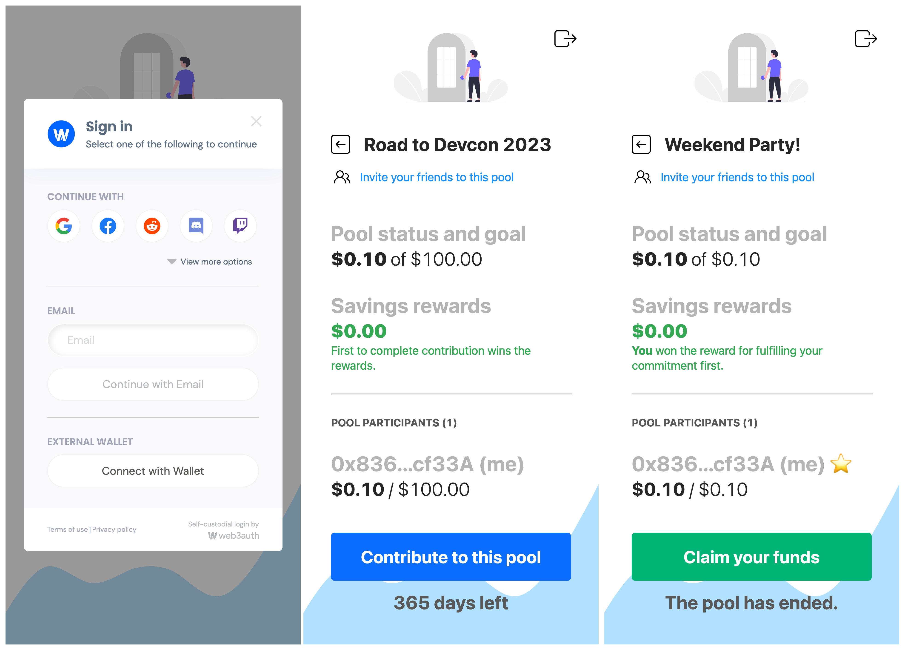

# Sava

> Descentralized Collaborative Savings Platform For Latin America

**Problem**: 60% of Latin Americans don't save at all. 

There are 600 million Latin Americans. Per Capita GDP in Latam is $8,093 USD.

So, 360 million Latin Americans don't save, which means almost $2.9 trillion USD is not saved at all.

**Solution**: We created a descentralized application that allows any person to save money collaboratively by creating a savings pool and inviting friends to join.

Sava is running #onPolygon in the Mumbai testnet.

We used @Web3Auth to facilitate the onboarding because we're targeting people who are not very familiar with crypto at this time. 

Thanks to Web3Auth we allow users to join a pool even by signing up with Google, Facebook and email.

Users can create a savings pool by specifying a name, a savings goal that all pool users are aiming for, and a target date to achieve it.

A friend can join a pool by sending money to it. Then, they will share the same savings pool and will share the savings goal. 

We strongly believe that adding a social component to savings efforts will encourage people to save more.

## Addendum for Polygon Bounty in relation to ETHBogota 2022.

### Target Polygon Bounty:

> $4,000 for best local LATAM public goods or Refi project(s)

### Summary 

This Public Good aims to empower communities with internet enabled mobile devices to benefit from the bounty of opportunity that Web3 and DeFi brings. As an added bonus it even cultivates the very good habit of saving as well.

### The Local Case: Network Effects

The beauty of this saving mechanism is that it builds upon an existing established informal saving mechanism called "Baca" in Colombia, similar mechanisms already exist in other Latin American countries as well.

On top of this the reward mechanism behind the platform, gets more attractive the more people participate in the pool and the longer the people lock up their funds.

The familiar community behaviour as well as the growing incentives the more people participate exposes the Sava platform to massive network effects in Latin America.

### The Global Case: A Piece of the new Financial Future

Economic conditions that are found in Latin America exist in many places in the developing world. All share the lack of effective saving mechanisms. However, all, share strong familial communities, are increasingly getting more connected to the internet and share strong aspirations for a better life. 

Sava is designed to be an easily accessible public good. It that can be used in other DeFi/ReFi services, It's incentives grow stronger the more people join the platform – this is just the catalyst that gets all these global communities to that better life.

#### Polygon
We are using Polygon because of its quick finality times, its cost effective gas costs and, most importantly, its DeFi ecosystem which makes Sava's platform rewards work. 
Sava's contract address on Mumbai: 0x23aEbE528C2ef0C269418d72F5F344B13cA74DED

#### Web3Auth
We are using Web3Auth. It is integral to the mission of making the onboarding experience as frictionless as possible on our platform Sava.

#### ETH Foundation
This project is designed as a public good, not to earn a profit. It's core goal is to engage communities to save together through gamification and network effects – where the more participants the more rewards there are.

## Read about Sava on Twitter

What we built and why we built it on Polygon: https://twitter.com/csacanam/status/1579036129285656576


## Screenshots

We have taken screenshots of Sava's features and stored them in the `screenshots` directory. Here is a preview:



## Running Sava locally

Prerequisites: [Node (v16 LTS)](https://nodejs.org/en/download/) plus [Yarn](https://classic.yarnpkg.com/en/docs/install/) and [Git](https://git-scm.com/downloads)

> clone/fork:

```bash
git clone https://github.com/jachinte/sava
```

> install and start your frontend:

```bash
cd comm-savings
yarn install
yarn start
```
